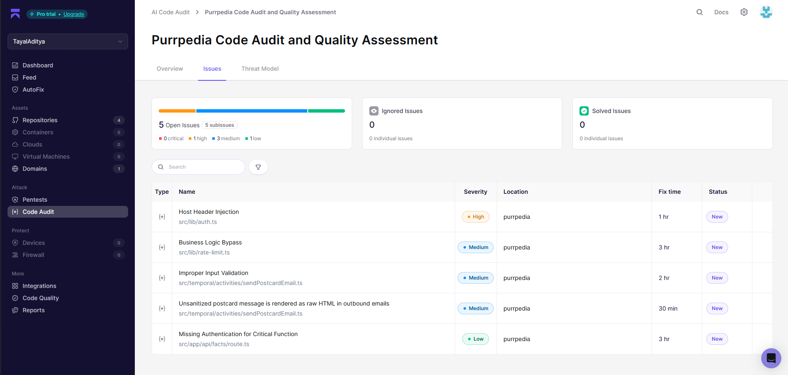
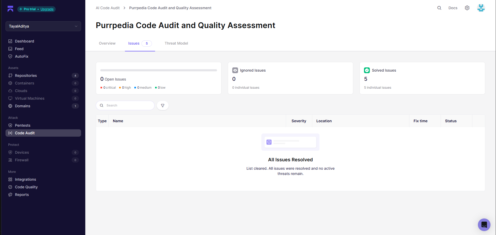

# PurrPedia

**The internet's most over-engineered love letter to cats.**

Built for [#HackTheKitty 2026](https://hackthekitty.devpost.com) — a full-stack cat encyclopedia that does way more than just list breeds.

---

## What is this?

PurrPedia started with a simple question: *what if a cat encyclopedia actually felt fun to use?*

So we built one with paw-print cursors that follow your mouse, synthesized meow sounds (no audio files — pure Web Audio API wizardry), a postcard designer, a personality quiz, and a name generator that produces gems like **"Professor Biscuit McFluffington, Destroyer of Curtains"**.

It's a Next.js 16 app with a PostgreSQL backend, magic-link auth, Temporal workflows for scheduled emails, and a whole lot of cat energy.

---

## Features

**Breed Index** — Browse 247+ cat breeds with photos, temperament bars, Wikipedia summaries, and origin stories. Every breed gets its own page.

**Cat Facts** — Swipeable TikTok-style fact cards. Swipe through them with touch, keyboard, or mouse. Each one plays a little synthesized sound.

**Purr Postcards** — Design cat-themed postcards with a drag-and-drop canvas editor (Fabric.js). Add stickers, text, backgrounds. Schedule them to be delivered on any future date — your friend gets an email with a "View Your Purr" button.

**Daily Digest** — Subscribe to get a cat fact + breed spotlight + random cat photo delivered to your inbox every morning. Powered by Temporal durable workflows that survive server restarts.

**Which Cat Are You?** — A 7-question personality quiz that maps you to one of 10 cat breeds. You get a custom result card with your breed's traits, personality description, and accent color.

**Cat Name Generator** — Smash together titles, first names, last names, and suffixes into ridiculous royal cat names. Click to copy. Generate as many as you want.

---

## The little things

These aren't features — they're vibes:

- **Paw cursor** — your mouse turns into a little cat paw (custom SVG)
- **Paw trail** — every move leaves behind alternating left/right paw prints that fade out
- **Cat sounds** — meows, purrs, and swipe sounds synthesized live via Web Audio API. Zero audio files.
- **Scroll reveals** — sections animate in as you scroll (IntersectionObserver)
- **Dark mode** — full light/dark theme toggle
- **Mobile-first** — hamburger nav, touch swipe support, responsive everything

---

## Tech stack

- **Framework**: Next.js 16 (App Router)
- **Language**: TypeScript
- **Styling**: Tailwind CSS 4
- **Database**: PostgreSQL on [Neon](https://neon.tech) + Prisma ORM
- **Auth**: NextAuth v5 — magic link (email), no passwords
- **Workflows**: Temporal — handles digest scheduling and postcard delivery
- **Canvas editor**: Fabric.js
- **Email**: Nodemailer over SMTP
- **Validation**: Zod on every API endpoint
- **Fonts**: Playfair Display, DM Sans, DM Mono

---

## Getting started

```bash
git clone https://github.com/TayalAditya/purrpedia.git
cd purrpedia
npm install

cp .env.example .env
# Fill in DATABASE_URL, NEXTAUTH_SECRET, email creds, Cat API key

npx prisma db push
npm run dev
```

Open [localhost:3000](http://localhost:3000) and you're in.

You'll need:
- Node.js 18+
- A PostgreSQL database ([Neon](https://neon.tech) is free)
- A [Cat API](https://thecatapi.com) key (also free)
- Temporal server (optional — postcards/digests work without it, they just won't schedule)

Check [`.env.example`](.env.example) for all the env vars.

---

## Project structure

```
src/
  app/
    page.tsx              # Landing page
    breeds/               # Breed index + detail pages
    facts/                # Swipeable cat facts
    quiz/                 # Personality quiz
    name-generator/       # Cat name generator
    postcards/            # Postcard editor + viewer
    dashboard/            # User dashboard
    digest/               # Digest subscribe/unsubscribe
    api/                  # All API routes
  components/
    CatCursor.tsx         # Custom paw cursor
    PawTrail.tsx          # Mouse trail effect
    CatSounds.tsx         # Web Audio synthesizer
    ThemeToggle.tsx       # Dark mode
    MobileNav.tsx         # Responsive nav
    canvas/               # Fabric.js postcard editor
  temporal/
    workflows/            # Temporal workflow definitions
    activities/           # Email sending, etc.
  lib/
    auth.ts               # NextAuth config
    prisma.ts             # DB client
    rate-limit.ts         # API rate limiting
    cat-api.ts            # External API wrappers
```

---

## Security

We ran [Aikido Security](https://aikido.dev)'s AI code audit as part of the hackathon. It found 5 issues — we fixed all of them.

### Before (5 open issues)



### After (0 open, 5 solved)



### What we fixed

1. **Host Header Injection** (High) — `trustHost` in NextAuth was unconditionally `true`. Now it's only enabled when `AUTH_URL` is explicitly set.

2. **Business Logic Bypass** (Medium) — Rate limiting was IP-only, so someone behind a shared IP could exhaust limits for everyone. Switched to dual user-ID + IP limiting with memory cleanup to prevent DoS.

3. **XSS in emails** (Medium) — User content (names, messages) was injected raw into postcard email HTML. Added `escapeHtml()` to sanitize everything before rendering.

4. **Improper Input Validation** (Medium) — `postcardId` wasn't validated before database lookup. Added type/length checks.

5. **Missing Auth** (Low) — The `POST /api/facts` bulk-import endpoint had no auth check. Added session verification + rate limiting.

### Additional hardening

- **Security headers** via `next.config.ts` — CSP, HSTS (2yr), X-Frame-Options DENY, nosniff, Referrer-Policy, Permissions-Policy
- **Zod schemas** on every API POST endpoint
- **SSRF prevention** — breed IDs validated with `/^[a-z]{3,4}$/` before hitting external APIs
- **Rate limiting** on all public endpoints (30 req/min reads, 5 req/min writes)
- **No hardcoded secrets** — everything via env vars, `.env` gitignored

For the full audit report, see [docs/SECURITY_AUDIT.md](docs/SECURITY_AUDIT.md).

---

## License

MIT
